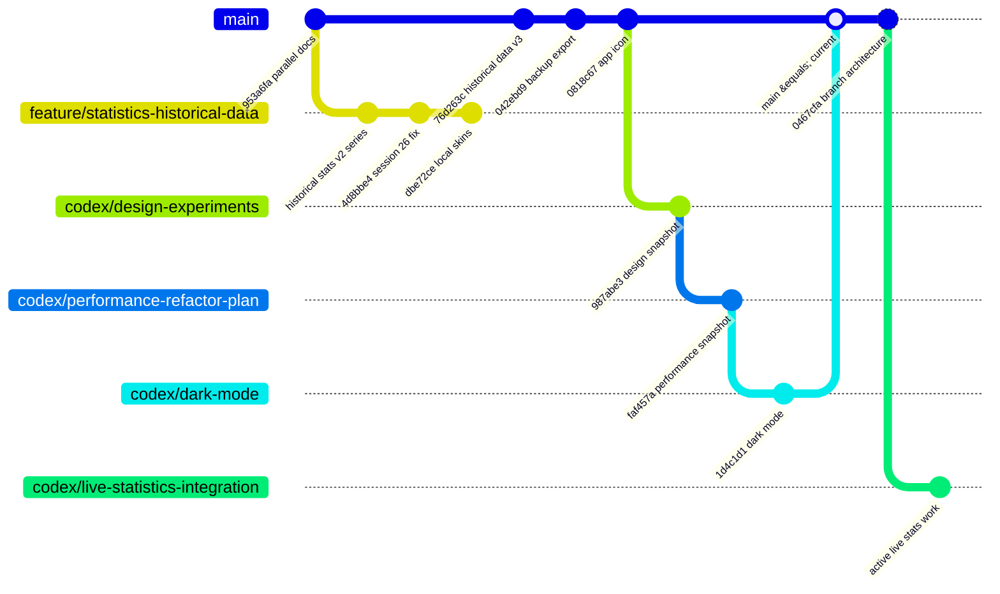

# Branch- og arkitekturbeslutninger

Dette dokument er projektets overordnede log for arkitekturbeslutninger, branch-strategi og parkerede spor.

## Vedligeholdelsesregel

Opdater dette dokument hver gang projektet tager en beslutning om:

- hvilke branches der oprettes, merges, parkeres eller slettes
- hvilke arkitekturspor der er aktive eller historiske
- hvorfor en branch ikke skal merges direkte
- hvilke dele af en gammel branch der skal porteres, droppes eller gemmes som reference
- hvilke test- og simulatorniveauer der er brugt som accept for beslutningen

Når dokumentet opdateres, bør ændringen commit'es sammen med den relevante beslutning eller som et separat dokumentationscommit.

## Aktuel hovedlinje

Sidst opdateret: 2026-05-31

| Branch | Status | Rolle |
|---|---|---|
| `main` / `origin/main` | Aktiv hovedlinje ved `0467cfa` | Indeholder design-snapshot, performance-snapshot, Dark Mode og branch-arkitekturlog. Dette er den aktuelle sandhed. |
| `codex/live-statistics-integration` | Aktiv arbejdsbranch | Integrerer data fra live spil i hele statistik-modulet. Oprettet fra `main` ved `0467cfa`. |
| `codex/dark-mode` | Merged til `main`, lokal reference | Kan slettes senere, men kan beholdes kort som reference til Dark Mode-arbejdet. |
| `codex/performance-refactor-plan` | Parkeret snapshot ved `faf457a` | Reference for performance-refaktoren: statistik-preparer/store og reduceret autosave i meldingsflow. |
| `codex/design-experiments` | Parkeret snapshot ved `987abe3` | Reference for plakatdesign, typografi og statistik/design-eksperimenter. |

## Branch-topologi

## Parkerede historiske grene

### `feature/statistics-historical-data`

Status: Parkeret. Skal ikke merges direkte.

Analyse:

- Grenen udspringer fra den gamle base `953a6fa`.
- Den indeholder 20 commits foran den gamle base og ligger 6 commits bag nuværende `main`.
- Den introducerede den første store historiske statistiklinje: v2-data, `HistoricalStatisticsEngine`, statistik-UI, tests og importdokumentation.
- Nuværende `main` har allerede videreført statistikarbejdet i nyere form, inklusive v3-data, `HistoricalStatisticsPreparer`, performance-snapshot og flere tests.
- En direkte merge fra grenen til `main` ville reelt rulle nyere arkitektur tilbage, blandt andet v3-data, performance-preparer, Dark Mode, app icon, fonts og backup-service.

Beslutning:

- Ingen direkte merge.
- Ingen cherry-pick nu.
- Brug kun grenen som historisk reference.
- Den eneste større ikke-integrerede produktide fra grenen er skin/1980-synthwave-sporet.

Mulig fremtidig branch:

| Branch | Formål | Bemærkning |
|---|---|---|
| `codex/skins-modern-port` | Portere skin/1980-ideer oven på nuværende `main` | Skal bygges på nye Dark Mode tokens og nuværende plakatdesign. Må ikke merges som gammel branch. |

### `codex/fix-historical-quality-notes`

Status: Parkeret. Skal ikke merges direkte.

Analyse:

- Grenen bygger oven på `feature/statistics-historical-data`.
- Den har 31 commits foran den gamle base og ligger 6 commits bag nuværende `main`.
- Den indeholder datakvalitetsrettelser, dokumenter, live sync, web-overblik, seneste-spil-redesign og mange design-/skin-assets.
- Datakvalitetsnotatet, korrektionsscriptet, `LiveSessionSync.swift` og `web/` findes allerede i `main` og matcher branchens filer.
- Nuværende `main` har nyere v3-auditfiler og v3-data, som grenen ikke har.
- En direkte merge ville rulle v3-sporet og nyere app-arkitektur tilbage.

Beslutning:

- Ingen direkte merge.
- Ingen cherry-pick nu.
- Brug grenen som historisk reference.
- Hvis live sync/web skal videreudvikles, sker det fra `main`, ikke fra denne branch.
- Hvis datakvalitet skal genbesøges, sker det mod v3-data og nuværende auditværktøjer.

## Integrationsprincipper

1. `main` er sandheden.
2. Gamle divergerede branches merges ikke blindt.
3. Før en gammel branch bruges, sammenlignes den mod nuværende `main`, ikke kun mod sin gamle merge-base.
4. Store gamle branches opdeles i emner: data, statistik, UI/design, live sync, docs og tests.
5. Integration sker som små moderne commits oven på `main`.
6. Direkte cherry-pick bruges kun, når committen ikke trækker gammel arkitektur eller gamle assets med sig.
7. UI/design-spor må ikke blandes ind i datakvalitets- eller performance-spor uden særskilt beslutning.
8. Performance-snapshot `faf457a` bevares som reference, når UI/Dark Mode ændres.

## Aktuelle beslutninger

| Dato | Beslutning | Begrundelse | Verifikation |
|---|---|---|---|
| 2026-05-31 | `main` er aktuel hovedlinje efter merge/push af Dark Mode | Dark Mode er færdig nok for nu, og `main`/`origin/main` peger på `1d4c1d1`. | Build og launch på iPhone 17 tidligere; XS-verifikation nedenfor. |
| 2026-05-31 | `feature/statistics-historical-data` parkeres | Statistikarbejdet er allerede videreført i nyere form på `main`; direkte merge ville tilbagerulle nyere arkitektur. | Branch-diff og API/test-sammenligning mod `main`. |
| 2026-05-31 | `codex/fix-historical-quality-notes` parkeres | Datakvalitet, live sync og web findes allerede i `main`; grenen mangler v3-sporet. | Byte-sammenligning af centrale filer og diff mod `main`. |
| 2026-05-31 | Skin/1980-sporet holdes separat | Det er et produkt/designspor med egen skin-environment og mange lokale farver; kræver modernisering mod Dark Mode tokens. | Kodegennemgang af `WhistSkin`, `HomeSkin1980Views` og gammel `HomeView`. |
| 2026-05-31 | Ingen ny integrationsbranch oprettes nu | Der er ingen moden ændring at integrere efter auditten. | `main` forblev rent. |
| 2026-05-31 | `codex/live-statistics-integration` oprettes | Live spil-data skal integreres i hele statistik-modulet som et nyt samlet arkitekturspor oven på `main`. | Branch oprettet fra ren `main` ved `0467cfa`. |

## Aktivt arkitekturspor: live spil i statistik

Branch: `codex/live-statistics-integration`

Formål:

- Integrere data fra live/registrerede spil i statistik-modulet, så statistik ikke kun bygger på historiske importerede data.
- Bevare den nye performance-arkitektur med `HistoricalStatisticsPreparer` og `HistoricalStatisticsStore`.
- Undgå at genåbne de parkerede historiske branches som integrationskilde.
- Sørge for at aktivt spil, seneste spil, spilledage og historiske data kan tænkes sammen uden at blande performance-refaktor og UI-design i samme commit, medmindre det er nødvendigt.

Første analysepunkter for branchen:

1. Kortlæg nuværende statistik-input: `HistoricalDataJSONLoader`, `HistoricalStatisticsEngine`, `HistoricalStatisticsPreparer`, `HistoricalStatisticsStore`, SwiftData `GameDay`/`RecordedHand`.
2. Afgør om live data skal samles i en ny domain-preparer, en adapter fra SwiftData til eksisterende historisk datastruktur, eller et separat kombineret statistiklag.
3. Bevar v3-historik som reproducerbar kilde og behandl live spil som appens aktuelle lokale datakilde.
4. Udvid tests før store UI-ændringer.
5. Verificer på iPhone XS simulator, da XS er reference for performance og layout.

## Verifikation 2026-05-31

iPhone XS-simulator:

- Simulator: `iPhone Xs`
- Runtime: iOS 18.6
- XcodeBuildMCP-profil: `whist20-xs`
- Testresultat: 32 tests, status `succeeded` i `.xcresult`
- Build + launch: lykkedes
- Screenshot/UI snapshot: lykkedes
- Runtime-logscan: ingen `signal 11`, `SIGSEGV`, crash eller fatal fejl fundet

## Fremtidig oprydning

Kandidater til senere oprydning, når projektet er trygt ved `main`:

| Branch | Foreslået handling |
|---|---|
| `codex/dark-mode` | Slet lokal reference, når Dark Mode ikke længere behøver separat pejlemærke. |
| `feature/statistics-historical-data` | Behold midlertidigt som historisk reference; slet først når eventuelle skin-ideer er vurderet. |
| `codex/fix-historical-quality-notes` | Behold midlertidigt som historisk reference; slet først når datakvalitets- og live sync-beslutninger er dokumenteret nok. |
| `test/*` branches | Kan sandsynligvis slettes efter separat bekræftelse. |

## Relaterede dokumenter

- `docs/PARALLEL_WORK.md` - koordinering mellem Cursor og Codex
- `TECHNICAL_HANDOFF.md` - teknisk opstart og arkitekturkort
- `docs/performance/statistik-arkitektur-og-live-integration.md` - performance- og statistikarkitektur
- `docs/statistik/live_statistics_integration_architecture.md` - konkret inputkort og målarkitektur for live-statistik
- `docs/statistik/historisk_data_reproducerbarhed_og_versionsstyring.md` - datareproducerbarhed
- `docs/statistik/data_audit_2026-05-26.md` - v3 data-audit
