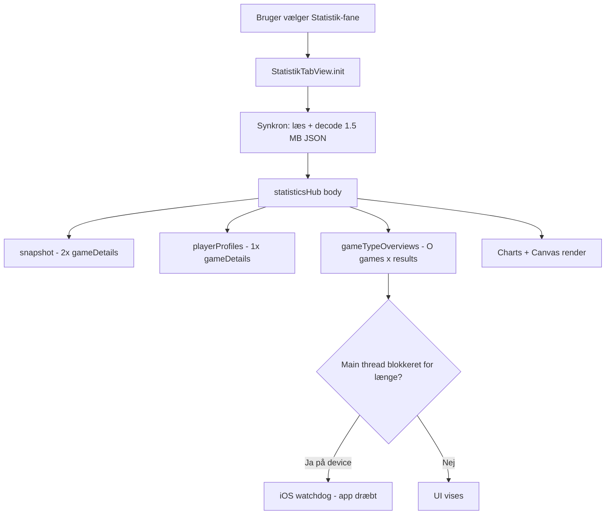
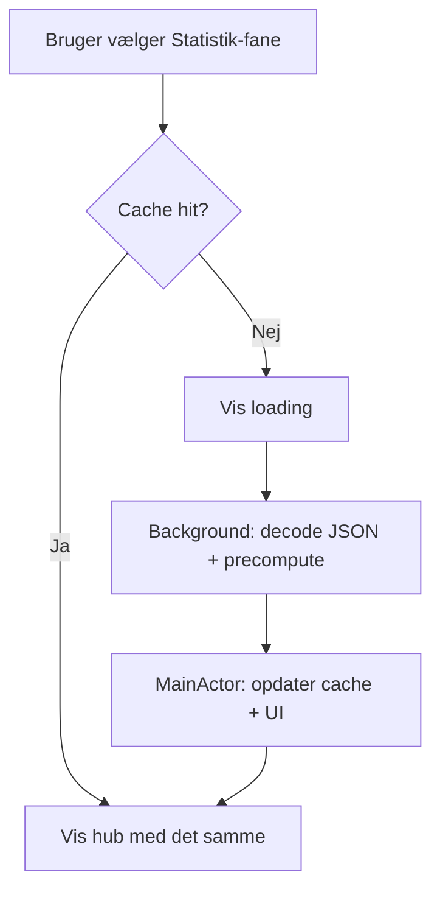

# Performance-analyse: Statistik-crash og langsom melding

**Dato:** 2026-05-28 (opdateret med best-practice-research samme dag)  
**Formål:** Handoff-dokument til implementering (fx Codex). Indeholder fund, hypoteser, anbefalede løsninger og **iOS best practice** fra Apple/officielle kilder.  
**Scope:** Whist20 iOS (`Whist20/`) — analyse og design; implementering følger separat.

---

## Executive summary

| Problem | Mest sandsynlige årsag | Karakter |
|--------|------------------------|----------|
| Statistik «crasher» på fysisk iPhone | Main thread blokeres i flere sekunder (JSON + tunge beregninger); iOS dræber appen (watchdog `0x8badf00d`) | Opleves som crash, men er ofte **frys + kill** |
| Statistik føles langsom | Samme arbejde gentages ved **hvert** besøg på fanen; ingen cache | Performance |
| Melding langsom | Hyppige **SwiftData `save()`** + scoring/UI-genberegning i `body` under wheel-scroll | Performance |

Simulator har mere CPU/RAM og er mere tolerant over for main-thread blokering — derfor ses problemet primært på rigtige enheder.

---

## 1. Kontekst og datastørrelser

### Historisk JSON (runtime)

| Ressource | Størrelse | Indhold (v3) |
|-----------|-----------|--------------|
| `Whist20/Resources/HistoricalData/whist_historical_data_v3.json` | ~1,54 MB (1.542.253 bytes) | 903 spil, 3.612 `playerResults`, 32 sessions, 4 spillere |
| `whist_historical_data_v2.json` (også i app-bundle) | ~1,1 MB | Bruges **ikke** i app ved runtime; kun i tests/legacy |

Loader: `HistoricalDataJSONLoader` med `HistoricalDataPack.primary` → kun v3.

### Vigtige filer

| Fil | Linjer (ca.) | Rolle |
|-----|--------------|-------|
| `Whist20/Features/StatistikTabView.swift` | ~4.786 | UI + mange aggregeringer inline |
| `Whist20/Domain/HistoricalStatisticsEngine.swift` | ~974 | Domænelogik, `gameDetails`, profiler, sessions |
| `Whist20/Features/AddHandView.swift` | ~1.967 | Melding + resultat-flow |
| `Whist20/Persistence/HandDraftPersistence.swift` | ~143 | Kladde-JSON + `context.save()` |
| `Whist20/ContentView.swift` | — | Fane-switch; opretter `StatistikTabView()` on demand |

---

## 2. Statistik: hvad der sker trin for trin

### 2.1 Ingen load ved app-start

- `Whist20App` / `ContentView`: SwiftData `@Query` af `GameDay` — **ingen** historisk JSON.
- Historik loades først når brugeren vælger Statistik-fanen.

### 2.2 Fanen genoprettes ved hvert besøg

`ContentView` bruger `switch selectedTab`:

```swift
case .statistics:
    StatistikTabView()
```

Når brugeren forlader Statistik, fjernes view’et. Næste besøg = **ny `init`**, ny JSON-load og fuld genberegning. Ingen cache på app- eller fane-niveau.

### 2.3 Synkron JSON i `StatistikTabView.init` (main thread)

```swift
init(loader: HistoricalDataJSONLoader = HistoricalDataJSONLoader()) {
    dataResult = Result { try loader.load() }
}
```

`HistoricalDataJSONLoader.load()`:

1. `Data(contentsOf: url)` — synkron fil-I/O  
2. `JSONDecoder().decode(HistoricalWhistData.self, from: data)` — synkron på hele ~1,5 MB  

Dette kører i view-initializeren → typisk **main actor / main thread** i SwiftUI.

### 2.4 `statisticsHub` — tungt arbejde ved første `body`

Ved success kaldes `statisticsHub(data)` fra `body`. I hub’en beregnes **synkront** (før ScrollView vises stabilt):

```swift
let allSnapshot = HistoricalStatisticsEngine.snapshot(from: data, scope: .all)
let currentData = HistoricalStatisticsEngine.scopedData(from: data, scope: .current)
let currentOverview = HistoricalStatisticsEngine.sessionOverviews(from: currentData).last
let playerProfiles = HistoricalStatisticsEngine.playerProfiles(from: data)
let gameTypes = gameTypeOverviews(from: data)
```

| Operation | Datasæt | Kommentar |
|-----------|---------|-----------|
| `snapshot(.all)` | Fuld | Kalder internt `gameDetails` **mindst 2×** (`gamesWithQualityIssues` + `dataQualityIssueCounts`) |
| `playerProfiles` | Fuld | 1× effektiv `gameDetails` + tung per-spiller bearbejdning |
| `sessionOverviews(current)` | Sidste session (scope `.current`) | Mindre, men stadig `gameDetails` for scoped data |
| **`gameTypeOverviews`** | Fuld | **Kritisk flaskehals** — se §2.5 |
| UI | — | ~42× `Chart`, custom `HistoricalTimelineCanvas`, mange `.font(.custom(...))` |

`@State selectedScope` / `recentSessionLimit` bruges i **under-navigation** (fx tendenser), ikke i hub — men **enhver** `StatistikTabView.body`-invalidation genkører hub-beregningerne.

### 2.5 Hovedsynder: `gameTypeOverviews` — O(spil × resultater)

`HistoricalStatisticsEngine.gameDetails` er lineær og korrekt indekseret:

```swift
let resultsByGame = Dictionary(grouping: data.playerResults, by: \.gameId)
// ... én gang, derefter O(games) lookup
```

`gameTypeOverviews` (private i `StatistikTabView`, ca. linje 3659+) gør derimod:

```swift
let allGameDetails = Dictionary(uniqueKeysWithValues: data.games.compactMap { game in
    let sessionsById = Dictionary(uniqueKeysWithValues: data.sessions.map { ($0.id, $0) })
    let results = data.playerResults.filter { $0.gameId == game.id }
    // ... byg HistoricalGameScoreDetail
})
```

**Per spil (903×):**

- `sessionsById` genbygges → ~29.000 små dictionary-allokeringer  
- `playerResults.filter` over 3.612 rækker → **~3,26 mio.** sammenligninger  

Samme funktion kaldes **igen** ved navigation til «Spiltyper» (`gameTypesOverviewView`, ca. linje 1012).

### 2.6 Gentagne `gameDetails` i engine (hub-besøg)

Groft estimat for **ét** hub-besøg:

- `snapshot`: 2× fuld `gameDetails`  
- `playerProfiles`: 1× fuld `gameDetails`  
- `sessionOverviews` (current): 1× (lille scope)  
- `gameTypeOverviews`: 903× ineffektiv detalje-bygning  

Ingen delt cache mellem kald eller fanebesøg.

### 2.7 Ekstra spike: «Alle spilledage»

`allSessionsView` (ca. linje 692+):

- `sessionOverviews(from: data)` for **alle** 32 sessions  
- Per session: fulde `gameDetails` + `HistoricalSessionProgressPoint` (op til spil × 4 spillere ≈ 3.612 punkter totalt)  
- Heatmap + flere charts  

Kan give **memory spike** efter hub er loadet — særligt på ældre iPhones.

### 2.8 Mindre sandsynlige crash-årsager

| Årsag | Sandsynlighed | Note |
|-------|---------------|------|
| Manglende `whist_historical_data_v3.json` i bundle | Lav | `ContentUnavailableView`, ikke crash |
| `Dictionary(uniqueKeysWithValues:)` med duplikat-nøgler | Lav i historik-data | Fatal crash; også i `MeldingStatusCard.rowsByKey` hvis duplikat-rækkenøgler i `MeldingPresentation` |
| Font `ArchivoRoman-Regular` vs registreret `Archivo.ttf` | Lav for crash | Fallback-typografi; ekstra layout |
| `fatalError` ved SwiftData-opstart | Kun launch | `Whist20App.makeModelContainer` |

---

## 3. Melding: hvorfor det føles langsomt

Melding er **ikke** den primære statistik-crash-kilde, men har klare performance-problemer.

### 3.1 Synkron SwiftData-save

`HandDraftPersistence.upsertPending` afslutter med:

```swift
try? context.save()
```

på **main thread** efter JSON-encode af kladde.

### 3.2 Resultat-trin: mange autosave-triggers

`ResultStepView` har `onChange` på bl.a. `actualTricks`, `trumpAfterPlay`, `vipLevel`, `partner`, `dutySeat`, **`solTricks`** → `scheduleResultAutosave()` med 500 ms debounce, derefter `upsertPending`.

Wheel pickers sender mange værdier under scroll → mange debounced saves.

**Sol:** stepper erstatter hele `solTricks`-dictionary → `onChange(of: draft.solTricks)` ved hvert trin.

### 3.3 Scoring og præsentation i `body`

```swift
private var normalResultSections: some View {
    let scores = draft.finalScores()
    // ...
}
```

`finalScores()` → `ScoringEngine` ved **hver** re-render. `MeldingPresentation.from(draft:)` i `MeldingStatusCard` genberegnes også ofte.

### 3.4 Melding-trin (bud) er lettere

`BidStepView` autosaver primært ved «Næste» / navigation — ikke ved hvert felt under redigering. Sløvhed er mest på **resultat** (VIP/sol) og `onAppear`-upsert på halve-trumf.

### 3.5 Øvrigt

- `gameDay.hands.map` i computed properties — SwiftData-relationship ved body  
- `LiveSessionSyncCoordinator.schedulePush` kun hvis API konfigureret (`AppInfoAdditions.plist` har typisk tomme URL’er)  
- `ActiveGameView.loadedDraft` decoder JSON i computed property ved hver body  

---

## 4. Device vs. simulator

| Faktor | Fysisk enhed | Simulator |
|--------|--------------|-------------|
| Main-thread blokering 5–20+ s | Watchdog kill (`0x8badf00d`) | Ofte bare lag |
| ~3,3 mio. loop-iterationer | Sekunders freeze | Kan stadig mærkes, men mildere |
| Memory spike (alle sessions + charts) | Jetsam under pressure | Mere headroom |
| Tab genoprettelse | Fuld cold load hver gang | Samme adfærd |

---

## 5. Hypoteser rangeret (Statistik «crash»)

1. **Watchdog** pga. main-thread blokering: `init` JSON + `statisticsHub` (især `gameTypeOverviews`)  
2. **Gentagen fuld reload** ved hvert fanebesøg (ingen cache / vedvarende view)  
3. **Memory pressure / jetsam** ved «Alle spilledage» eller mange charts  
4. **SwiftUI-render** af stor view-fil under load (sekundær)  
5. **Rigtig crash** via `Dictionary(uniqueKeysWithValues:)` (usandsynlig med nuværende historik)  
6. **Manglende bundle-ressource** (meget usandsynlig for v3)

---

## 6. iOS best practice (research) — og match mod Whist20

Følgende er sammenfattet fra **Apples officielle dokumentation** og udbredte iOS/SwiftUI-mønstre (2024–2026). Det understøtter og præciserer vores konkrete løsningsforslag i §7.

### 6.1 Main thread og watchdog (Apple)

Apple beskriver eksplicit, at watchdog (`0x8badf00d`) udløses når main thread blokeres, bl.a. ved:

- Synkront netværk  
- **Behandling af store datamængder, fx store JSON-filer**  
- Synkron Core Data-migration, tung Vision-analyse m.m.

Kilde: [Addressing watchdog terminations](https://developer.apple.com/documentation/xcode/addressing-watchdog-terminations)

**Anbefaling fra Apple:** Flyt al langkørende kode, der ikke er kritisk for det synlige UI, til en **baggrundskø**. Main thread skal kunne behandle scroll, tap og frame updates.

**Whist20 i dag:** `Data(contentsOf:)` + `JSONDecoder` + millioner af loop-iterationer i `statisticsHub` på main thread — matcher præcist Apples «store JSON»-eksempel.

**Vurdering:** §7 Fase A er **påkrævet**, ikke valgfri optimering.

### 6.2 JSON-decode og CPU-arbejde (fælles praksis + Sentry/performance-værktøjer)

- JSON-decode og efterfølgende aggregation bør **ikke** køre på main thread for payloads over ~få titusinde bytes, især når decode tager >40 ms (Sentry flagger «JSON Decoding on Main Thread» ved ~40 ms+).  
- Kilde (værktøjspraksis): [Sentry — JSON Decoding on Main Thread](https://docs.sentry.io/product/issues/issue-details/performance-issues/json-decoding-main-thread/)

**Mønster (Swift concurrency):**

1. Læs + decode + aggregate **off** `@MainActor`  
2. Hop til `@MainActor` **kun** for at sætte UI-state (`@State` / `@Observable`)

**Whist20:** Hele pipeline i `StatistikTabView.init` + `statisticsHub` body — omvendt af best practice.

### 6.3 SwiftUI + concurrency (Apple WWDC25 / tutorials)

| Best practice | Kilde | Whist20-gap |
|---------------|-------|-------------|
| Brug **`.task` / `.task(id:)`** til async arbejde ved view lifecycle; automatisk cancel ved disappear | [View.task](https://developer.apple.com/documentation/swiftui/view/task(id:name:priority:file:line:_:)), WWDC25 «Explore concurrency in SwiftUI» | Load i `init` i stedet for `.task` |
| Undgå **`Task { }` i `body`**; undgå at hele `Task` er `@MainActor` når den indeholder decode/IO | WWDC25 «Elevate an app with Swift concurrency», Apple tutorial «Adopting Swift concurrency» | Synkron init; risiko for `Task { @MainActor in ... decode ... }` |
| CPU-tung kode: **`nonisolated` type** eller **`@concurrent`** (Swift 6.2+) så arbejde kører på thread pool | WWDC25 «What's new in Swift» | `HistoricalStatisticsEngine` kaldes fra main-isolated view |
| UI-state kun på main; del **Sendable** snapshots til baggrund, ikke mutable view state | WWDC25 «Explore concurrency in SwiftUI» | `HistoricalWhistData` er `Equatable`/`Codable` — egnet til at sende resultater tilbage |
| Tjek **`Task.isCancelled`** ved lang precompute hvis view forsvinder | `.task` dokumentation | Tab-skift ødelægger view — cancel er vigtigt |

**Konkret mønster til Codex (statistik):**

```swift
// Pseudokode — ikke copy-paste uden integration i arkitektur
@MainActor @Observable final class StatisticsViewModel {
  enum Phase { case idle, loading, ready(PreparedStatistics), failed(Error) }
  var phase: Phase = .idle

  func loadIfNeeded(loader: HistoricalDataJSONLoader) {
    guard case .idle = phase else { return }
    phase = .loading
    Task {
      let prepared = await StatisticsPreparer.prepare(loader: loader) // off main
      guard !Task.isCancelled else { return }
      phase = .ready(prepared)
    }
  }
}

enum StatisticsPreparer {
  static func prepare(loader: HistoricalDataJSONLoader) async -> PreparedStatistics {
    // nonisolated / @concurrent: read bundle, decode, snapshot, gameTypes, ...
  }
}
```

Brug **`.task { viewModel.loadIfNeeded() }`** på `StatistikTabView` — **ikke** `init { try loader.load() }`.

### 6.4 Cache og forberedt data (arkitektur)

Best practice for «tunge skærme»:

- **Decode én gang** per app-session (eller indtil JSON-version ændrer sig)  
- **Precompute** aggregater (snapshot, game type overviews) off main thread  
- **Lazy** først ved navigation til dybe views («Alle spilledage», enkelt spiller)  
- Overvej **inkrementel** UI: vis hub med skeleton → udfyld metrics når klar (progressive loading)

Whist20 mangler alle fire punkter.

### 6.5 SwiftData og hyppige saves (Apple + community)

| Best practice | Kilde | Whist20-gap |
|---------------|-------|-------------|
| Tung persistence **off main** via **`@ModelActor`** med egen `ModelContext` | [Use Your Loaf — SwiftData background tasks](https://useyourloaf.com/blog/swiftdata-background-tasks/), SwiftData-produktionsguides | `HandDraftPersistence.upsertPending` → `context.save()` på main |
| Send **`PersistentIdentifier`** på tværs af actors, ikke `@Model`-objekter | Apple/SwiftData concurrency | `GameDay` bruges direkte i autosave |
| Små transaktioner; undgå save på **hver** UI-tick | Generel DB-praksis | Debounced save ved hvert wheel-step |
| Main context til UI; batch/background til import | Swift Crafted m.fl. | Kladde er lille JSON — men **save-frekvens** er problemet |

**Konkret mønster til Codex (melding):**

- `@ModelActor actor PendingHandStore` med `upsertPending(gameDayId: PersistentIdentifier, snapshot: ...)`  
- Main view kalder `await store.scheduleUpsert(...)` — encode kan ske på main (lille payload), **save** på actor  
- Alternativ (mindre invasiv): behold main context, men **reducer antal `save()`** (kun ved `onDisappear` / trin-skift)

### 6.6 UI-rendering (SwiftUI)

- Undgå tung beregning i **`body`**; brug cached/`@State` afledte værdier (Apple: main thread skal kunne tegne frames).  
- Store lister/charts: **lazy** containers, begræns data sendt til `Chart` hvor muligt.  
- Custom fonts: registrer korrekt PostScript-navn (undgår ekstra layout-pass) — sekundært.

### 6.7 Verifikation (Apple + værktøjer)

| Metode | Hvad det viser |
|--------|----------------|
| **Instruments → Time Profiler** (device) | Main-thread tid i `JSONDecoder`, `gameTypeOverviews` |
| **Instruments → Hangs** | UI-freezes der korrelerer med watchdog |
| **Xcode Organizer crash logs** | `0x8badf00d`, `scene-create` / `scene-update` |
| **MetricKit** (valgfrit senere) | Hang rate i produktion |
| **Unit test med `measure`** | Regression på `prepare()` tid |

Apple anbefaler performance-profilering **før release** og overvågning efter release (jf. watchdog-dokumentation).

### 6.8 Opsummering: skal ind i implementeringen?

| # | Best practice | Allerede i §7? | Handling |
|---|---------------|----------------|----------|
| 1 | Ingen stor JSON/decode på main | Delvist (A1) | **Præciser:** fjern sync `init`; brug `.task` + actor |
| 2 | Precompute + session-cache | Delvist (A3) | Behold; tilføj `PreparedStatistics` type |
| 3 | Fix O(n²) før/parallel med offload | A2 | Uændret prioritet |
| 4 | `.task` + cancellation | Ny | Tilføj til Fase A |
| 5 | `@concurrent` / nonisolated preparer | Ny | Tilføj til Fase A (Swift 6.2 hvis target tillader) |
| 6 | `@ModelActor` for pending kladder | Ny | Tilføj til Fase C (eller C1-alternativ) |
| 7 | Ikke `finalScores()` i `body` | C2 | Uændret |
| 8 | Progressive loading UI | Ny | Tilføj til Fase A/B |
| 9 | Instruments/acceptkriterier | D | Udvid med Hangs + watchdog-log |

---

## 7. Anbefalede løsninger (implementeringsplan for Codex)

Prioriter i denne rækkefølge for størst effekt / lavest risiko. **§6 er den normative begrundelse; denne sektion er den konkrete opgaveliste.**

### Fase A — Statistik: stop main-thread blokering (kritisk)

**A1. Baggrundsindlæsning af historik** *(align med Apple watchdog + SwiftUI `.task`)*

- **Fjern** synkron `loader.load()` fra `StatistikTabView.init`.
- Introducér `@MainActor` `StatisticsViewModel` (eller `StatisticsDataStore`) med `loading | ready(PreparedStatistics) | failed`.
- Start load med **`.task { await store.loadIfNeeded() }`** på view — ikke `onAppear` + manuel `Task` i `body`.
- Kør `Data(contentsOf:)`, `JSONDecoder.decode`, `snapshot`, `gameTypeOverviews` (efter A2) i **`nonisolated`/`@concurrent` async** funktion eller dedikeret `actor StatisticsPreparer`.
- Ved tab-skift væk: `.task` annullerer — tjek `Task.isCancelled` før main-thread UI-opdatering.
- Vis **`ProgressView` / skeleton** i hub mens `phase == .loading` (progressive loading).

**A2. Fix `gameTypeOverviews` algoritme**

- Erstat den nested loop med:
  - Én gang: `let details = HistoricalStatisticsEngine` — enten eksponér `gameDetails(from:)` som `internal`/`package` eller tilføj `gameDetailsByGameId(from:)` i engine.
  - Én gang: `sessionsById`, `playersById`, `resultsByGame` (grouping).
- Forventet: fra ~O(games × results) til ~O(games + results).

**A3. Del cache på tværs af fanebesøg** *(session-level cache — best practice §6.4)*

- Hold `PreparedStatistics` (decoded data + precomputed snapshot/gameTypes/profiler) i:
  - `@StateObject` injiceret fra `ContentView` / environment, **eller**
  - `actor`/`@Observable` singleton med `loadGeneration` — **eller**
  - Behold `StatistikTabView` i hierarkiet (skjult) i stedet for `switch` der deallokerer.

Minimum: cache **decoded JSON**; mål: cache hele `PreparedStatistics` så andet fanebesøg er O(1).

### Fase B — Statistik: reducer redundant arbejde

**B1. Letvægt hub**

- `statisticsHub` skal ikke kalde `playerProfiles` + `gameTypeOverviews` hvis kun antal/metrics til NavigationLink — beregn lazy i destination views eller ved første navigation.

**B2. Undgå dobbelt `gameDetails` i `snapshot`**

- I `HistoricalStatisticsEngine.snapshot`: beregn `gameDetails` én gang, genbrug til `issueCount` og `dataQualityIssueCounts`.

**B3. «Alle spilledage»**

- Lazy: load `sessionOverviews` kun når view vises; overvej paginering eller fold-ud pr. session.
- Undgå at holde alle `gameDetails` + alle progress points i memory på én gang hvis muligt.

**B4. Bundle**

- Fjern `whist_historical_data_v2.json` fra app target release build hvis ikke nødvendig (reducerer install size; påvirker ikke runtime hvis v3 altid bruges).

### Fase C — Melding: autosave og body-arbejde

**C1. Færre og sikrere `context.save()`** *(align med SwiftData `@ModelActor` — §6.5)*

- **Kort sigt (lav risiko):** Autosave ved resultat kun ved `onDisappear`, trin-skift, og debounce med længere interval; behold `guard existing.draftJSON != json`.
- **Mellem sigt (anbefalet):** `@ModelActor actor PendingHandStore` — `save()` på baggrundskontekst; main view sender `PersistentIdentifier` + encoded snapshot (lille `Codable`, `Sendable`).
- Undgå `Task { @MainActor in ... save() }` der samler decode + disk på main.

**C2. Cache scoring i UI**

- `@State private var previewScores: [Seat: Int]?` opdateret i `onChange` — ikke `let scores = draft.finalScores()` direkte i `body`.

**C3. Sol-tricks `onChange`**

- Bind stepper til enkelt sæde; opdater dictionary uden at erstatte hele struct hvis Observable tillader det, eller brug `onChange` på specifikke felter.

**C4. `ActiveGameView`**

- Cache decoded kladde i `@State` opdateret når `pendingHand` ændres — ikke decode i computed property hver body.

### Fase D — Kvalitet og verifikation

**D1. Instruments (device)** *(Apple anbefaling — §6.7)*

- **Time Profiler:** tab-skift til Statistik — `JSONDecoder`, `gameTypeOverviews`, `gameDetails`.
- **Hangs:** korrelation med UI-freeze før watchdog.
- **Allocations:** navigation til «Alle spilledage».

**D2. Enhedslog / crash reports**

- `Termination Reason` / `0x8badf00d` = watchdog (ofte **ikke** bug i stack top — Apple advarer om at main-thread backtrace kan vise «uskyldig» kode).
- `scene-create` / `scene-update` i termination description = UI ikke tegnet/opdateret i tide.
- `JetsamEvent` = memory pressure.

**D3. Tests** (jf. `.cursor/rules/testing-ci.mdc`)

- Performance/regression: `gameTypeOverviews` og hub-load under tidsgrænse (kan køre på CI med historisk JSON i test bundle).
- Eksisterende `HistoricalStatisticsEngineTests` loader begge JSON-packs i test — ikke repræsentativt for app, men god til decode-regression.

**D4. Font (kosmetisk/performance)**

- Align `ActiveGamePosterStyle.resumeFontName` med faktisk PostScript-navn for `Archivo.ttf` (undgå fallback-layout).

---

## 8. Forslag til PR-opdeling

| PR | Indhold | Risiko | Effekt |
|----|---------|--------|--------|
| 1 | `gameTypeOverviews` fix + engine `gameDetails` genbrug | Lav | Meget høj |
| 2 | `StatisticsPreparer` + `.task` + off-main decode/precompute + loading UI | Medium | Meget høj (watchdog; Apple-aligned) |
| 3 | `PreparedStatistics` session-cache / vedvarende fane | Lav | Høj (gentagne besøg) |
| 4 | Hub afmagring (lazy metrics) | Medium | Medium |
| 5a | Melding: færre `save()` + `finalScores` cache | Lav–medium | Høj (melding UX) |
| 5b | Melding: `@ModelActor PendingHandStore` (valgfri efter 5a) | Medium | Medium (main-thread saves) |
| 6 | Fjern v2 fra release bundle | Lav | Lav (install size) |

---

## 9. Arkitekturdiagram (nuværende adfærd)



**Målarkitektur (efter fix):**



---

## 10. Kodereference-indeks

| Emne | Fil | Ca. linje |
|------|-----|-----------|
| Fane opretter Statistik | `Whist20/ContentView.swift` | 43–44 |
| Synkron init-load | `Whist20/Features/StatistikTabView.swift` | 33–35 |
| statisticsHub beregninger | `Whist20/Features/StatistikTabView.swift` | 57–62 |
| gameTypeOverviews O(n²) | `Whist20/Features/StatistikTabView.swift` | 3659–3683 |
| Effektiv gameDetails | `Whist20/Domain/HistoricalStatisticsEngine.swift` | 805–831 |
| snapshot dobbelt gameDetails | `Whist20/Domain/HistoricalStatisticsEngine.swift` | 236–260, 790–802 |
| JSON loader | `Whist20/Domain/HistoricalDataJSONLoader.swift` | 45–55 |
| upsertPending + save | `Whist20/Persistence/HandDraftPersistence.swift` | 111–122 |
| Resultat autosave | `Whist20/Features/AddHandView.swift` | 731–757 |
| finalScores i body | `Whist20/Features/AddHandView.swift` | 760–762 |
| Bundle v2+v3 | `Whist20.xcodeproj/project.pbxproj` | resources |

---

## 11. Acceptkriterier (forslag)

- [ ] Statistik-fane åbner på fysisk iPhone (ældste understøttede enhed) **uden** freeze > 2 s og uden watchdog-kill (`0x8badf00d`).
- [ ] **Instruments Hangs:** ingen hang > 400 ms ved første åbning af Statistik efter fix.
- [ ] Andet besøg på Statistik-fane (efter tab-skift væk og tilbage) **uden** fuld re-decode hvis data uændret.
- [ ] Navigation til «Spiltyper» og «Alle spilledage» uden sekundær multi-sekunders freeze.
- [ ] VIP/sol resultat: wheel-scroll uden mærkbar hakken; antal `context.save()` under 1 pr. 2 s ved kontinuerlig scroll (målbart i debug-log).
- [ ] Eksisterende `HistoricalStatisticsEngineTests` og relevante UI-flows grønne i CI.
- [ ] (Valgfrit) `measure`-test: `StatisticsPreparer.prepare` < 1 s på CI-mac med v3 JSON.

---

## 12. Verifikation uden kode (bruger)

1. Device log efter «crash»: skelne watchdog (`0x8badf00d`, `scene-create`/`scene-update`) vs. jetsam vs. EXC_*.
2. Test kun hub vs. hub + «Alle spilledage» for at isolere spike.
3. Melding: notér om sløvhed er på bud, halve-trumf eller resultat/VIP/sol.

---

## 13. Kilder (best practice-research)

| Emne | Reference |
|------|-----------|
| Watchdog, store JSON, flyt arbejde væk fra main | [Addressing watchdog terminations](https://developer.apple.com/documentation/xcode/addressing-watchdog-terminations) (Apple) |
| Main thread balance, `@MainActor`, async | [Adopting Swift concurrency](https://developer.apple.com/tutorials/app-dev-training/adopting-swift-concurrency) (Apple) |
| SwiftUI `.task`, cancellation | [View.task(id:...)](https://developer.apple.com/documentation/swiftui/view/task(id:name:priority:file:line:_:)) (Apple) |
| Offload CPU, `@concurrent`, nonisolated | WWDC25 [Elevate an app with Swift concurrency](https://developer.apple.com/videos/play/wwdc2025/270/), [Explore concurrency in SwiftUI](https://developer.apple.com/videos/play/wwdc2025/266/), [What's new in Swift](https://developer.apple.com/videos/play/wwdc2025/245/) |
| JSON decode on main (performance issue) | [Sentry — JSON Decoding on Main Thread](https://docs.sentry.io/product/issues/issue-details/performance-issues/json-decoding-main-thread/) |
| SwiftData background / `@ModelActor` | [SwiftData background tasks](https://useyourloaf.com/blog/swiftdata-background-tasks/) (Use Your Loaf) |
| Watchdog debugging | [Jesse Squires — main thread watchdog](https://www.jessesquires.com/blog/2022/08/11/implementing-a-main-thread-watchdog-on-ios/) |

---

*Genereret ud fra kodegennemgang og web-research 2026-05-28. Repo: `janusmoos/whist2` / `Whist20/`.*
